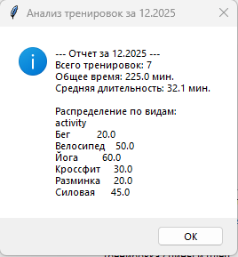
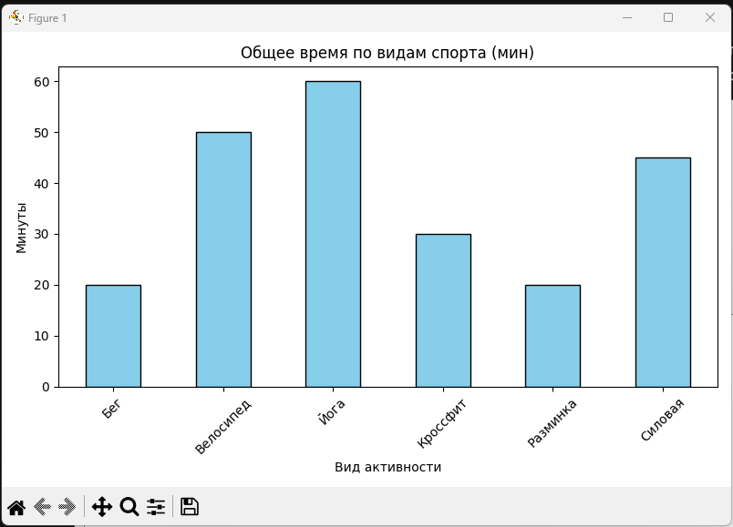
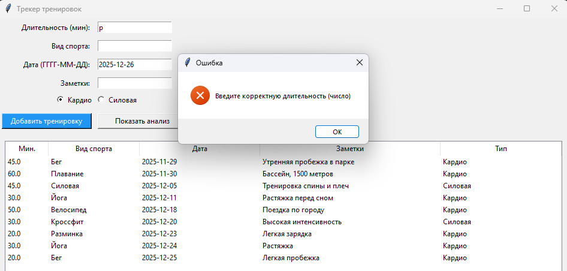

# Workout Tracker (Трекер личных тренировок) 
Приложение на Python для мониторинга физической активности и анализа спортивного прогресса. Позволяет вести учет тренировок, классифицировать их по типам и визуализировать результаты за месяц.

## Основные функции
 - Логирование активностей: Запись длительности (в минутах), вида спорта, даты и личных заметок.  
 - Классификация: Разделение нагрузок на «Кардио» и «Силовые» для лучшего понимания структуры тренировок.    
 - Автоматическая валидация: Проверка корректности ввода времени тренировки (защита от ошибок).  
 - Спортивная аналитика (Pandas): Подсчет общего и среднего времени активности за месяц, группировка данных по видам спорта.  
 - Визуализация (Matplotlib): Наглядная гистограмма распределения нагрузки по видам спорта.  

## Технологии
**Python 3.x** — основной язык разработки.  
**Tkinter** — графический интерфейс пользователя (GUI).  
**Pandas** — высокоуровневый анализ и обработка данных.  
**Matplotlib** — построение графиков и диаграмм.  
**CSV** — формат хранения истории тренировок.  

## Структура проекта
**main.py** — запуск приложения.  
**models.py** — модель данных Workout.  
**storage.py** — логика сохранения данных в файл workout_history.csv.  
**gui.py** — интерфейс трекера и табличное отображение.  
**analysis.py** — математический анализ данных и генерация графиков.  
**utils.py** — функции валидации и очистки текста.  
**README.md** — документация проекта.  
**tests.py** — Unit-тесты для проверки логики моделей и функций анализа.

## Инструкция по запуску
Убедитесь, что у вас установлен Python 3.10+.

Установите необходимые библиотеки:  
***pip install pandas matplotlib***

Запустите программу:  
***python main.py***

## Как пользоваться
Введите время тренировки в минутах.  
Укажите вид спорта (например, Бег, Йога или Велосипед).  
Выберите тип нагрузки (Кардио/Силовая).  
Нажмите «Добавить тренировку».  
При необходимости можно удалять ошибочные или устаревшие записи прямо через интерфейс с автоматическим обновлением хранилища.  
Для просмотра итогов введите месяц и год в блоке анализа и нажмите «Показать анализ».  

## 📸 Скриншоты

### Главное окно приложения

### Аналитика и графики

### Валидация данных

